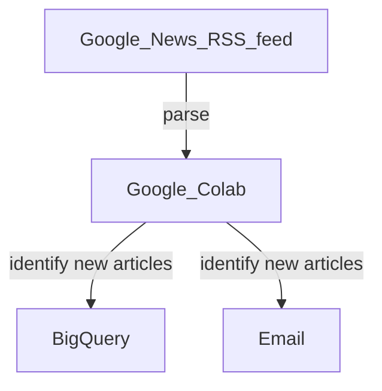

For modules [DSA4262](https://nusmods.com/courses/DSA4262/sense-making-case-analysis-health-and-medicine) and [DSA5101](https://nusmods.com/courses/DSA5101/introduction-to-big-data-for-industry).

# Introduction

[Portfolio](https://kohwyhow.com/)

# Pre-requisites

1. Get faculty/instructor to apply for [Google Cloud](https://support.google.com/google-cloud-higher-ed/answer/10324552) credits or [Azure](https://azure.microsoft.com/en-us/free/students) for students. 
2. Alternatively, get a trial account on either [Google Cloud](https://cloud.google.com/?hl=en) ($300 credits for 90 days) or [Azure](https://azure.microsoft.com/) ($200 credits for 12 months)
3. [Optional] Join the [Google Cloud Innovators](https://cloud.google.com/innovators?hl=en) program for free lab credits on Google Cloud Skills Boost

# Cloud computing
1. Benefits: scalability, cost-efficiency, and accessibility.
   * Automatically scale resources up or down based on demand.
   * Example: E-commerce websites handling traffic surges during sales.
   * Pay only for what you use (pay-as-you-go).
   * Avoid upfront investments in hardware.
   * Access resources and services from anywhere with an internet connection.
   * Enable remote collaboration and global reach.

2. Real-world examples and use cases.
   * Store and analyze patient data securely.
   * Use AI for diagnostics (e.g., detecting anomalies in medical images).
   * Real-time fraud detection and risk analysis.
   * High-frequency trading applications.
   * Personalize customer experiences using big data.
   * Optimize supply chain and inventory management.

3. Overview of popular providers: GCP, Azure, AWS.
   * Google Cloud:
      * Known for machine learning and data analytics services
      * Offers solutions like BigQuery and TensorFlow  
   * Azure:
      * Integration with Microsoft tools (e.g. Office 365, Power BI)
      * Popular in enterprise environments
   * AWS:
      * Pioneer in cloud services
      * Broad service portfolio, global reach, mature ecosystem
  
4. Key services: compute, storage, databases, and analytics.
   * Compute:
      * Virtual Machines (VMs): GCP Compute Engine, Azure VMs, AWS EC2
      * Containers: GCP Kubernetes Engine, Azure Kubernetes Service, AWS ECS
      * Serverless functions: GCP Cloud Functions, Azure Functions, AWS Lambda
   * Storage:
      * Object storage: GCP Cloud Storage, Azure Blob Storage, AWS S3
   * Databases:
      * Relational: GCP BigQuery, Azure SQL Database, AWS RDS
      * NoSQL: GCP Firestore, Azure CosmosDB, AWS DynamoDB
   * AI/ML:
      * GCP Vertex AI Studio, Azure Machine Learning Studio, AWS SageMaker
      
5. Differences between on-premise vs. cloud environments.

| Feature  | On-Premise | Cloud | 
| ------------- | ------------- | ------------- |
| Infrastructure Costs  | High upfront costs | Pay-as-you-go |
| Maintenance | Requires in-house expertise | Handled by your provider |
| Scalability | Limited by hardware capacity | Unlimited, subject to budget |
| Accessibility | Local network access only | Accessible from anywhere |

6. Introduction to regions, availability zones, and redundancy.
   * Regions:
      * Geographical locations where providers host data centers.
      * Example: [AWS](https://aws.amazon.com/about-aws/global-infrastructure/regions_az/), [GCP](https://cloud.google.com/about/locations#asia-pacific)
   * Availability zones:
      * Isolated data centers within a region.
      * Designed for high availability and fault tolerance.
   * Redundancy:
      * Backup resources to ensure uptime.
      * Example: Cross-region replication of data.

7. How cloud pricing works: pay-as-you-go and reserved models.
   * Pay-as-You-Go:
      * Charges based on actual usage (e.g., compute hours, storage GBs).
      * Flexible and cost-effective for variable workloads.
   * Reserved Models:
      * Commit to usage for a fixed period (e.g., 1 year, 3 years).
      * Provides significant cost savings for predictable workloads.
   * [Azure Pricing Calculator](https://azure.microsoft.com/en-us/pricing/calculator/), [Google Cloud Pricing Calculator](https://cloud.google.com/products/calculator), and [AWS Pricing Calculator](https://calculator.aws/#/)

# Compare services between AWS, GCP, Azure

| Criteria  | Google Cloud | Azure | AWS |
| ------------- | ------------- | ------------- | ------------- |
| Ease of use  | Simple console interface, easiest to learn for newcomers  | Familiarity for enterprises using Microsoft tools | Better for users with prior cloud experience, robust documentation and training materials |
| Educational resources  | [Google Cloud Skills Boost](https://www.cloudskillsboost.google/) for hands on labs  | Free credits for educators/students through [Azure for Education](https://azureforeducation.microsoft.com/en-us/Institutions) | [AWS Educate](https://aws.amazon.com/education/awseducate/), [AWS Academy](https://aws.amazon.com/training/awsacademy/), [AWS Skill Builder](https://skillbuilder.aws/) |

2. [Comparison](https://cloud.google.com/docs/get-started/aws-azure-gcp-service-comparison):
   * Google Cloud: Great for AI/ML, big data analytics, or cloud-native applications like Kubernetes
   * Azure: Ideal for enterprise setups, hybrid cloud, or Microsoft-heavy environments
   * AWS: Wide range of services on a global network of availability zones and regions

3. Recommendation:
   * If not sure which one to start with, start with Google Cloud
   * [Getting Started with Google Cloud Learning Path](https://www.cloudskillsboost.google/paths/8)
   * Other tutorials can be found on [Cloud Tasks](https://cloud.google.com/docs/ai-ml)

# Hands-on: Parse RSS feed, store news in a data warehouse, and email alerts of any new articles

Links:
1. [Google News RSS feed](https://news.google.com/rss/topics/CAAqJggKIiBDQkFTRWdvSUwyMHZNRGx1YlY4U0FtVnVHZ0pWVXlnQVAB?hl=en-US&gl=US&ceid=US:en)
2. [Google Colab](https://colab.research.google.com/)

Steps:
1. Register for a [Google Cloud](https://cloud.google.com/cloud-console) account.
2. Start a new project, give it any name you like.
3. Select the new project, copy and paste the project ID onto Sticky Note/Notepad on your laptop.
4. Search for a service called **BigQuery**, and create a new dataset and table.
5. When creating the table, edit the schema to include columns **Title**, **Link**, **Published**, and **Summary**. All should be **STRING**.
6. Copy and paste the dataset ID and table ID onto your Sticky Note/Notepad.
7. Search for a service called **Credentials**, and create a service account. The result should be a JSON file. Save this JSON file on your laptop.
8. Head to your Google Accoumt to create an app password, as detailed [here](https://knowledge.workspace.google.com/kb/how-to-create-app-passwords-000009237).
9. There is a file named [Google_News_RSS_Feed.ipynb](https://github.com/atlas-github/nus_cloudcomputing/blob/main/Google_News_RSS_Feed.ipynb) in this repository. Open in Colab, and create a copy in your Drive.
10. Fill in the details in the code:
    * project_id
    * dataset_id
    * table_id
    * credentials
    * email_sender
    * email_password
    * email_recipient
11. Run your Colab notebook.
12. After the code runs, verify whether you have received the email, and check your BigQuery table for new rows.

# Certifications
1. [Google Cloud](https://cloud.google.com/learn/certification)
2. [Azure](https://azure.microsoft.com/en-us/resources/training-and-certifications#azure-certifications)
3. [AWS](https://www.aws.training/certification)
